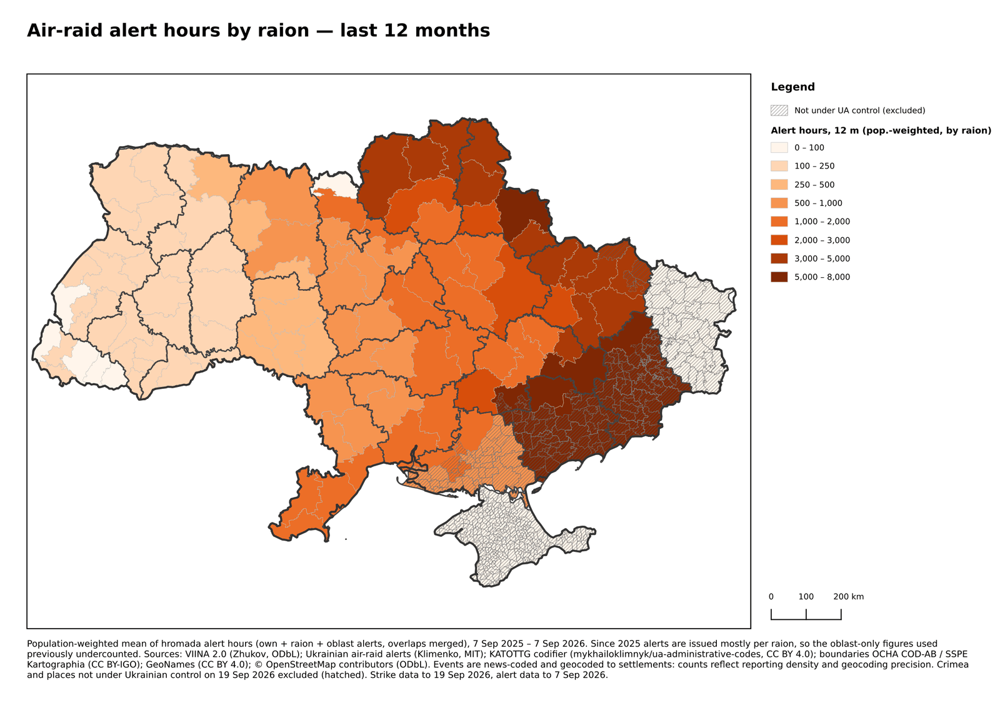
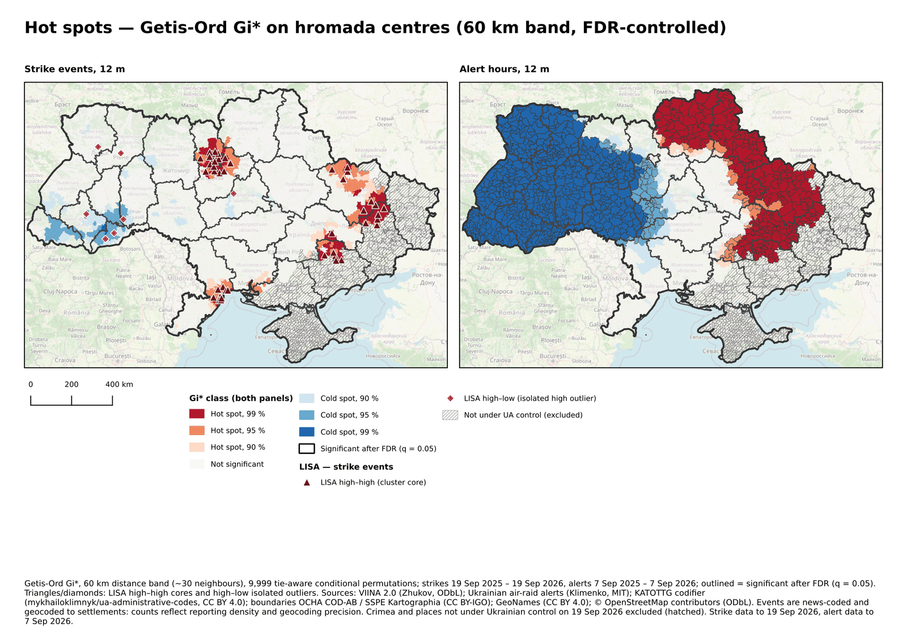
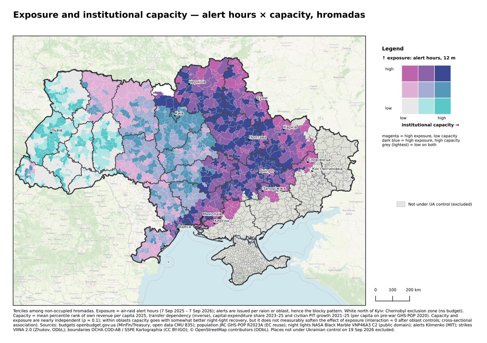
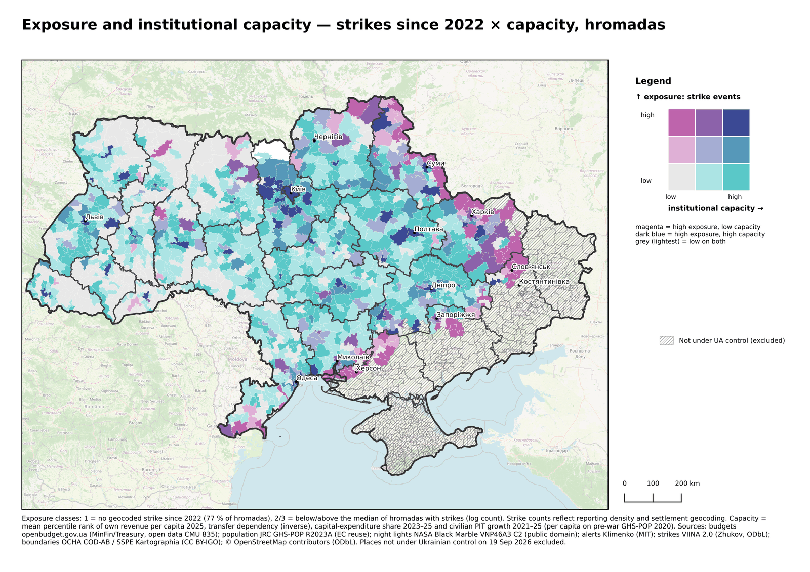
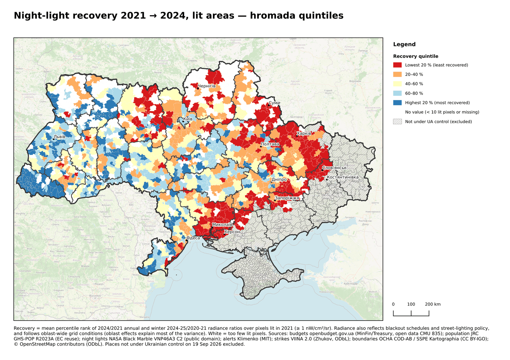
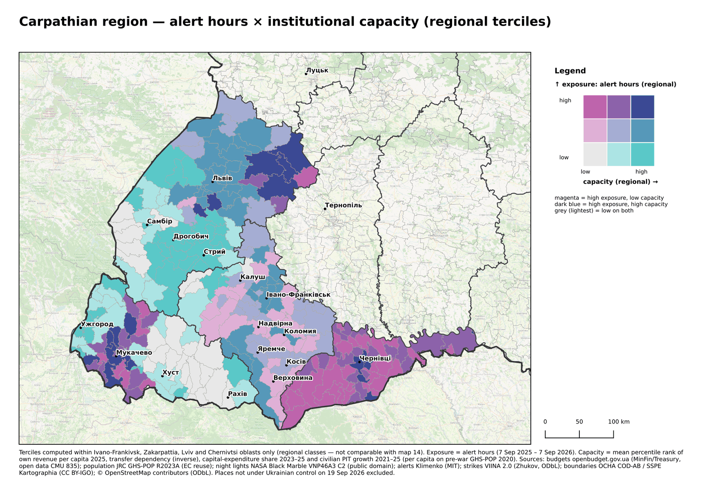

# Map previews

Downscaled previews of the QGIS atlas pages, generated by `viina/make_map_previews.py`.
Full-resolution PNG and PDF pages are published as release assets, not in git.

> Data: VIINA 2.0 (ODbL); air-raid alert records, V. Klymenko (MIT); OCHA COD-AB / SSPE Kartographia (CC BY-IGO); openbudget.gov.ua; NASA Black Marble; JRC GHS-POP; DREAM. Analysis and maps: M. Garand, UBEC Platform, CC BY 4.0.

Pages held back pending review:

- 01: risk index with strike detail, last 12 months (R5 review)
- 02: strikes by settlement, last 12 months (R1/R5)
- 03: strike points, last 12 months (R5)
- 18: IOM DTM and reSCORE context (upstream terms)
- 19: recent light level, last 12 months (R2)
- 20: change class to the most recent 12 months (R2)

## 04 · alert hours

## 11 · gi star

## 14 · resilience alerts capacity

## 15 · resilience strikes capacity

## 16 · resilience recovery

## 17 · carpathian resilience

