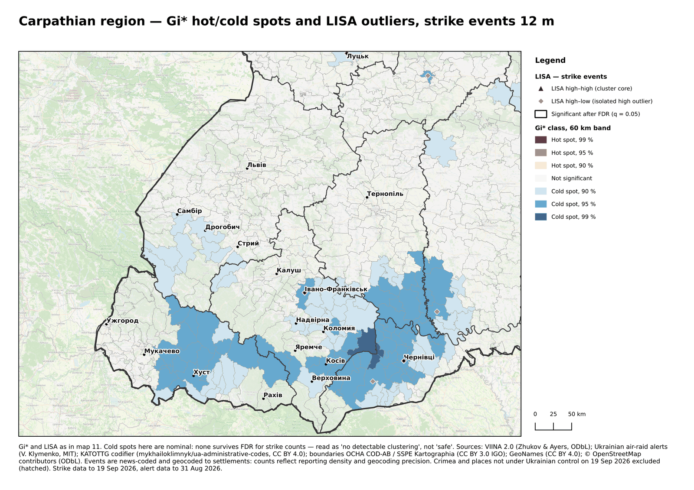
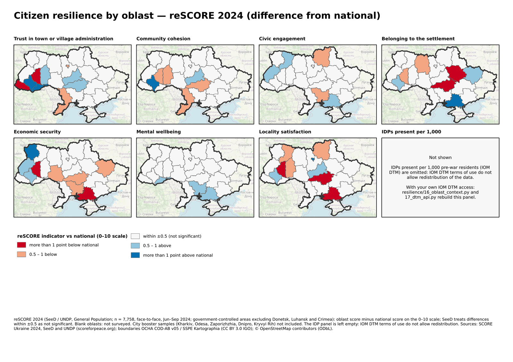
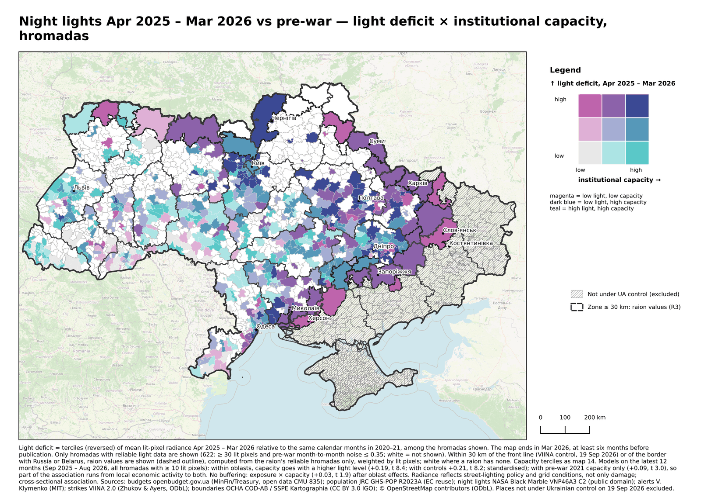
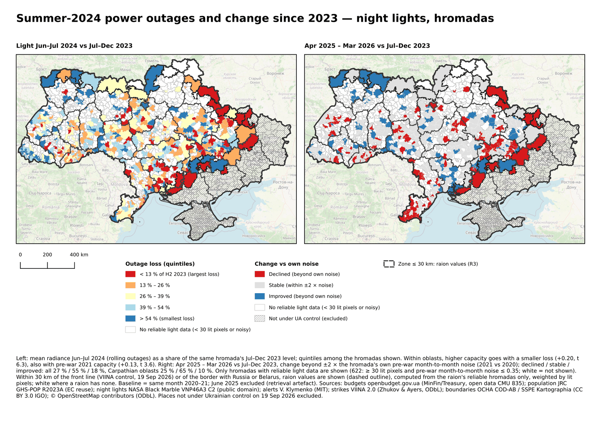

# Map previews

Downscaled previews of the QGIS atlas pages, generated by `viina/make_map_previews.py`.
Full-resolution PNG and PDF pages are published as release assets, not in git.

> Data: VIINA 2.0, Zhukov & Ayers (ODbL); air-raid alert records, V. Klymenko (MIT); OCHA COD-AB / SSPE Kartographia (CC BY 3.0 IGO); openbudget.gov.ua; NASA Black Marble; JRC GHS-POP; DREAM. Analysis and maps: M. Garand, UBEC Platform, CC BY 4.0.

Pages held back pending review:

- 01: risk index with strike detail, last 12 months (R5 review)
- 02: strikes by settlement, last 12 months (R1/R5)
- 03: strike points, last 12 months (R5)
- 05: strike points, last 12 months, on H3 r7 cells (R1/R5)
- 06: interpolated strike surface, 5 km grid, marks reported targets (R1/R3)
- 07: interpolated strike surfaces (R1)
- 08: interpolated strike surfaces (R1/R3)
- 09: interpolated alert surface; hromada choropleth is page 04 (R1)
- 10: kernel density from event locations (R1/R5)
- 11: Gi* hot spots at hromada level, incl. the front-line and border zone (R3)
- 12: kernel density on 1 km grid with strike points (R1/R5)

## 04 · alert hours

## 13 · carpathian hotspots

## 14 · resilience alerts capacity

## 15 · resilience strikes capacity

## 16 · resilience recovery

## 17 · carpathian resilience

## 18 · oblast context

## 19 · trajectory level capacity

## 20 · trajectory outage

